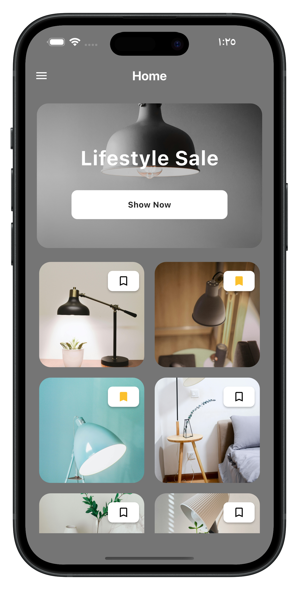
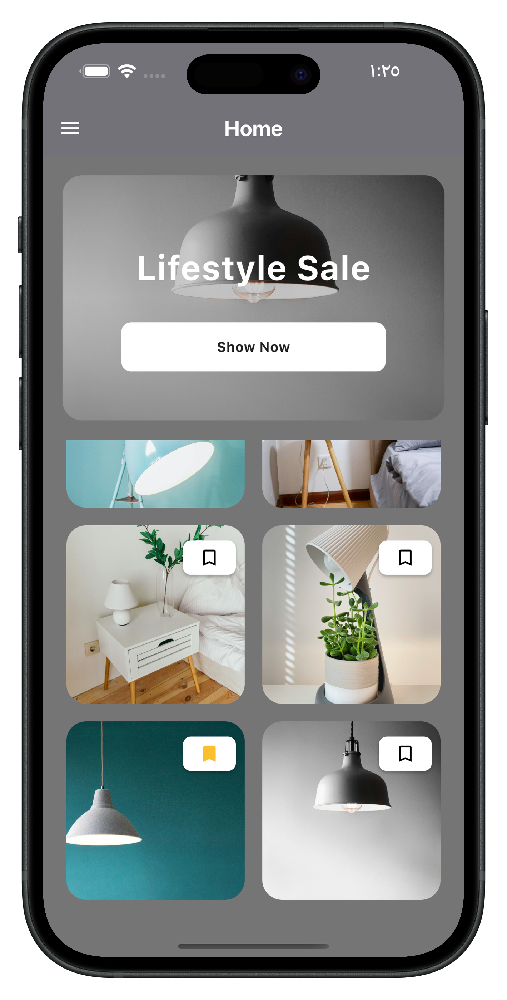

# gridview_ui

Discover the elegance of simplicity with this Lifestyle Sale App. The app's modern design showcases an inviting and user-friendly interface, perfect for exploring lifestyle products. Featuring a prominent promotional banner for exclusive sales, followed by a visually appealing grid of product images, the app makes shopping easy and enjoyable. Its minimalist layout ensures smooth navigation, creating a seamless experience for users to browse, discover, and shop their favorite items

  
   

- [Lab: Write your first Flutter app](https://docs.flutter.dev/get-started/codelab)
- [Cookbook: Useful Flutter samples](https://docs.flutter.dev/cookbook)

For help getting started with Flutter development, view the
[online documentation](https://docs.flutter.dev/), which offers tutorials,
samples, guidance on mobile development, and a full API reference.
